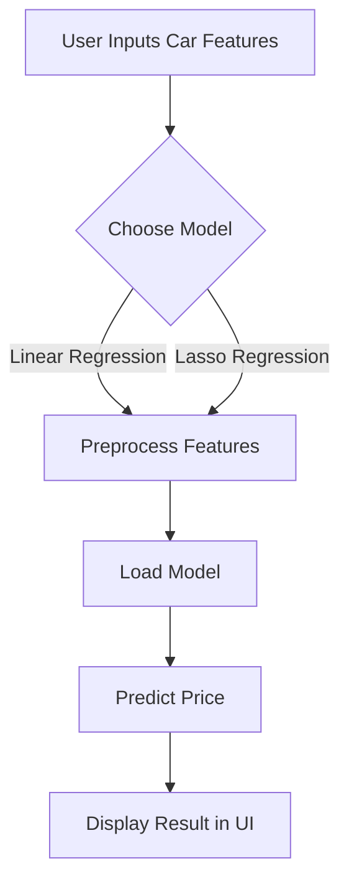

# <div align="center">Linear-Lasso-Regression-Car-Price-Prediction</div>

<div align="justify">

<p align="center">
  
  
  
  
  
  
  <a href="https://github.com/NhanPhamThanh-IT/Linear-Lasso-Regression-Car-Price-Prediction/stargazers"></a>
  <a href="https://github.com/NhanPhamThanh-IT/Linear-Lasso-Regression-Car-Price-Prediction/issues"></a>
  <a href="https://github.com/NhanPhamThanh-IT/Linear-Lasso-Regression-Car-Price-Prediction/network/members"></a>
  
  
  <a href="https://github.com/NhanPhamThanh-IT/Linear-Lasso-Regression-Car-Price-Prediction/blob/main/LICENSE"></a>
</p>

---

## Overview

**Linear-Lasso-Regression-Car-Price-Prediction** is an interactive web application that predicts the price of a car (or house) using machine learning models: Linear Regression and Lasso Regression. Built with [Streamlit](https://streamlit.io/), it provides an intuitive interface for users to input car features and instantly get price predictions using two different regression models.

- **Author:** Nhan Pham  
- **Email:** ptnhanit230104@gmail.com  
- **Version:** 1.0.0  
- **Created:** 2025-07-26

---

## Visual Workflow



---

## Features

- **User-friendly Web UI:** Built with Streamlit for easy interaction.
- **Dual Model Support:** Predict prices using both Linear Regression and Lasso Regression.
- **Instant Results:** Get predictions in real-time as you input data.
- **Educational:** Explore and compare the effects of different regression techniques.
- **Extensible:** Modular codebase for easy extension to other regression models or datasets.
- **Open Source:** Freely available for learning, research, and extension.
- **Well-documented:** Includes guides for dataset, models, and Streamlit usage.
- **Actively Maintained:** Issues and PRs are welcome!

---

## Table of Contents

- [Overview](#overview)
- [Visual Workflow](#visual-workflow)
- [Features](#features)
- [Demo](#demo)
- [How It Works](#how-it-works)
- [Example Prediction](#example-prediction)
- [Technical Stack](#technical-stack)
- [Dataset](#dataset)
- [Model Training](#model-training)
- [Installation](#installation)
- [Usage](#usage)
- [Advanced Usage](#advanced-usage)
- [Project Structure](#project-structure)
- [Extending the Project](#extending-the-project)
- [Troubleshooting & FAQ](#troubleshooting--faq)
- [Contributing](#contributing)
- [Changelog](#changelog)
- [Learning Resources](#learning-resources)
- [Requirements](#requirements)
- [License](#license)
- [Acknowledgements](#acknowledgements)
- [Contact](#contact)

---

## How It Works

1. **User Input:** Enter car features (year, price, kms driven, fuel type, seller type, transmission, owner).
2. **Model Selection:** Choose between Linear Regression or Lasso Regression.
3. **Preprocessing:** The app encodes categorical features and prepares the input for the model.
4. **Prediction:** The app loads the selected model (from `.pkl` files) and predicts the price.
5. **Result Display:** The predicted price is shown instantly in the UI.
6. **Model Comparison:** Users can easily compare predictions from both models to understand the impact of regularization.

---

## Example Prediction

Suppose you want to predict the price of a car with the following features:

| Feature         | Value         |
|-----------------|--------------|
| Year            | 2018         |
| Present Price   | 500000       |
| Kms Driven      | 30000        |
| Fuel Type       | Petrol       |
| Seller Type     | Individual   |
| Transmission    | Manual       |
| Owner           | 1            |

- **Step 1:** Enter these values in the app fields.
- **Step 2:** Click **With Linear model** or **With Lasso model**.
- **Step 3:** The app will display something like:

```
Predicted Price: $420,000.00
```

Try changing the model or input values to see how the prediction changes!

---

## Technical Stack

- **Frontend/UI:** [Streamlit](https://streamlit.io/) (Python-based web app framework)
- **Backend/ML:** [scikit-learn](https://scikit-learn.org/) (for model training and inference)
- **Data Handling:** [pandas](https://pandas.pydata.org/)
- **Visualization:** [matplotlib](https://matplotlib.org/) (for EDA and model training)
- **Serialization:** [pickle](https://docs.python.org/3/library/pickle.html) (for saving/loading models)
- **Jupyter Notebook:** For model development and experimentation

---

## Dataset

- **Source:** See [`dataset/car_data.csv`](dataset/car_data.csv)
- **Description:** Contains 301 rows and 9 columns, including features like `Year`, `Present_Price`, `Kms_Driven`, `Fuel_Type`, `Seller_Type`, `Transmission`, `Owner`, and the target `Selling_Price`.
- **Details:**
  - No missing values
  - Categorical features are encoded for model compatibility
  - For more, see [`docs/dataset.md`](docs/dataset.md)
- **Sample Columns:**
  - `Year`: Year of manufacture
  - `Present_Price`: Current ex-showroom price
  - `Kms_Driven`: Kilometers driven
  - `Fuel_Type`: Petrol/Diesel/CNG
  - `Seller_Type`: Dealer/Individual
  - `Transmission`: Manual/Automatic
  - `Owner`: Number of previous owners
  - `Selling_Price`: Price at which the car was sold (target)

---

## Model Training

- **Notebook:** [`model/model-training.ipynb`](model/model-training.ipynb)
- **Models:**
  - `linear_model.pkl`: Trained Linear Regression model
  - `lasso_model.pkl`: Trained Lasso Regression model
- **Workflow:**
  1. Data loaded and cleaned
  2. Categorical features encoded
  3. Data split into train/test sets
  4. Models trained and evaluated
  5. Best models saved as `.pkl` files
- **Learn more:**
  - [Linear Regression Guide](docs/linear-regression-model.md)
  - [Lasso Regression Guide](docs/lasso-regression-model.md)

---

## Installation

### 1. Clone the Repository

```bash
git clone https://github.com/NhanPhamThanh-IT/Linear-Lasso-Regression-Car-Price-Prediction.git
cd Linear-Lasso-Regression-Car-Price-Prediction
```

### 2. Install Dependencies

Create a virtual environment (optional but recommended):

```bash
python -m venv venv
source venv/bin/activate  # On Windows: venv\Scripts\activate
```

Install required packages:

```bash
pip install streamlit scikit-learn pandas matplotlib
```

### 3. (Optional) Retrain Models

If you want to retrain the models, open and run `model/model-training.ipynb` in Jupyter Notebook or VSCode.

---

## Usage

### 1. Run the App

```bash
streamlit run app/main.py
```

The app will open in your browser at [http://localhost:8501](http://localhost:8501).

### 2. Using the App

- Fill in the car features in the input fields
- Click **With Linear model** or **With Lasso model** to get a prediction
- The predicted price will be displayed instantly
- Try different inputs and compare model results

---

## Advanced Usage

- **Custom Port:** Run on a different port:
  ```bash
  streamlit run app/main.py --server.port 8502
  ```
- **Headless Mode:** For deployment:
  ```bash
  streamlit run app/main.py --server.headless true
  ```
- **Docker:** See [`docs/streamlit.md`](docs/streamlit.md) for Docker deployment instructions.
- **Streamlit Cloud:** Deploy directly from GitHub for free.
- **API Integration:** (Advanced) Wrap prediction logic in a FastAPI or Flask API for programmatic access.

---

## Project Structure

```
Linear-Lasso-Regression-Car-Price-Prediction/
├── app/
│   ├── main.py           # Streamlit app entry point
│   ├── predictor.py      # Model loading and prediction logic
│   └── ui.py             # Streamlit UI components
├── dataset/
│   └── car_data.csv      # Car price dataset
├── docs/
│   ├── dataset.md        # Dataset documentation
│   ├── lasso-regression-model.md  # Lasso regression theory & practice
│   ├── linear-regression-model.md # Linear regression theory & practice
│   └── streamlit.md      # Streamlit learning guide
├── model/
│   ├── lasso_model.pkl   # Trained Lasso model
│   ├── linear_model.pkl  # Trained Linear model
│   └── model-training.ipynb # Model training notebook
├── LICENSE
└── README.md
```

---

## Extending the Project

Want to add new features or support more models? Here are some ideas:

- **Add More Regression Models:** Integrate Ridge, ElasticNet, or custom models.
- **Feature Engineering:** Add new input features or transformations.
- **Visualization:** Show feature importance, residuals, or model diagnostics in the UI.
- **API Integration:** Expose predictions via a REST API for integration with other apps.
- **Deployment:** Deploy to Streamlit Cloud, Heroku, or Docker (see `docs/streamlit.md`).
- **UI Enhancements:** Add charts, explanations, or user authentication.

**How to add a new model:**
1. Train and save your model as a `.pkl` file.
2. Update `app/predictor.py` to load and use the new model.
3. Add a button or option in `app/ui.py` for users to select the new model.
4. Update the README and docs as needed.

---

## Troubleshooting & FAQ

**Q: The app doesn't start or crashes on launch.**
- Make sure all dependencies are installed (`pip install streamlit scikit-learn pandas matplotlib`).
- Check your Python version (should be 3.7+).
- Ensure you are running the command from the project root directory.

**Q: I get a ModuleNotFoundError for 'streamlit' or 'sklearn'.**
- Activate your virtual environment if you created one.
- Run `pip install -r requirements.txt` if you have a requirements file.

**Q: The prediction is always the same or seems off.**
- Check that the input features are reasonable and within the expected range.
- Make sure the model `.pkl` files are present in the `model/` directory.
- Retrain the models if needed using the provided notebook.

**Q: How do I deploy this app online?**
- See deployment instructions in [`docs/streamlit.md`](docs/streamlit.md) for Streamlit Cloud, Heroku, and Docker.

**Q: Can I use my own dataset?**
- Yes! Replace `dataset/car_data.csv` with your own data (matching the expected columns), retrain the models, and update the code as needed.

---

## Contributing

Contributions are welcome! To contribute:

1. Fork the repository
2. Create a new branch (`git checkout -b feature/your-feature`)
3. Make your changes and commit them
4. Push to your fork (`git push origin feature/your-feature`)
5. Open a Pull Request describing your changes

**Guidelines:**
- Write clear, descriptive commit messages
- Document new features or changes in the README/docs
- Follow PEP8 style for Python code
- Add tests or example usage if possible
- Please read our [Code of Conduct](CODE_OF_CONDUCT.md) before contributing.

---

## Changelog

See [CHANGELOG.md](CHANGELOG.md) for a list of major changes, new features, and bug fixes.

---

## Learning Resources

- [Streamlit Guide](docs/streamlit.md)
- [Linear Regression Guide](docs/linear-regression-model.md)
- [Lasso Regression Guide](docs/lasso-regression-model.md)
- [Dataset Guide](docs/dataset.md)
- [scikit-learn Documentation](https://scikit-learn.org/stable/)
- [Streamlit Documentation](https://docs.streamlit.io/)
- [Pandas Documentation](https://pandas.pydata.org/docs/)

---

## Requirements

- Python 3.7+
- streamlit
- scikit-learn
- pandas
- matplotlib

You can also create a `requirements.txt` file for easy installation:

```
streamlit
scikit-learn
pandas
matplotlib
```

---

## License

This project is licensed under the [MIT License](LICENSE).

---

## Acknowledgements

- [Streamlit](https://streamlit.io/)
- [scikit-learn](https://scikit-learn.org/)
- [pandas](https://pandas.pydata.org/)
- [matplotlib](https://matplotlib.org/)
- [UCI Machine Learning Repository](https://archive.ics.uci.edu/ml/) (for dataset inspiration)

---

## Contact

For questions, suggestions, or contributions, please contact:

- **Nhan Pham**  
- Email: ptnhanit230104@gmail.com

</div>